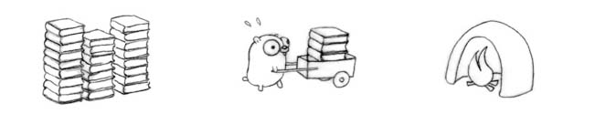
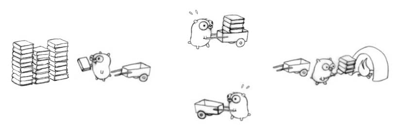
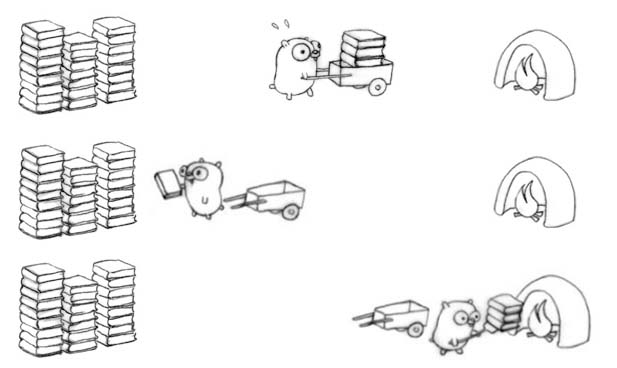

# Пособие о конкурентноти в Python

Начнем с определений, когда мы хотим выполнять одновременно более одной задачи, 
нам нужно разобраться с двумя понятиями: конкурентность и параллельность.

Конкурентность - возможность одновременного запуска нескольких программ или нескольких частей программы.
Программы в данном случае вовсе не обязательно будут выполняться одновременно

Параллелизм - одновременное выполнение нескольких задач.

Для того, чтобы описать разницу между этими понятиями, воспользуюсь примером Роба Пайка из его доклада "Concurrency is Not Parallelism". 
Представим задачу: у нас есть большая куча книг, есть печь в которой нужно эти книги сжечь и есть суслик, которому мы и поручим эту работу.

Задача конечно выполняется, книг становится всё меньше, но вот один суслик работает очень медленно.
Дадим ему в помощь ещё несколько сусликов.

Вот, другое дело! Работа закипела! 
Но есть ньюанс, сусликов стало в 4 раза больше, но вот их сумарная производительность возрасла немного меньше чем в 4 раза.
Почему так вышло? Теперь суслики помимо основной работы по сжиганию книг, должны внимательно следить друг за другом, чтобы банально не столкнуться, 
а также обмениваться сообщениями по типу "Я закончил сжигать книги и пошел за другими, ты можешь начать сжигать свои".
А ещё, если суслик подошел к печи с книгами, а там в это время работает другой суслик, тогда одному из них придется просто стоять и ждать без дела. 
Всё это накладывает расходы на систему, занижая общую производительность.

Кстати в зависимости от архитектуры, все суслики могут выполнять полный цикл: 
брать книги из кучи, вести их к печи, сжигать и возвращаться с пустой тележкой за следующей партией книг.
А могут отвечать за разные задачи: один суслик загружает книги в тележку, второй везет её к печи и возвращается обратно за следующей тележкой, 
третий сжигает книги в печи, а четвертый возвращает пустую тележку первому.
Свои недостатки есть как у первого так и у второго варианта, поэтому однозначного ответа для всех задач нет, нужно смотреть по ситуации.

Но есть и другой подход. Возьмем трех сусликов и дадим каждому из них свою стопку книг, свою тележку и свою печь.
Теперь они будут работать полностью независимо друг от друга. Вот это и называется параллельностью!

