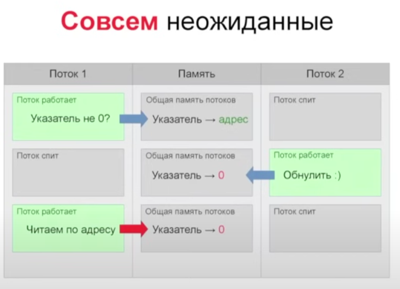

# Пособие о конкурентноти в Python

# Немного истории

Давайте вкратце рассмотрим, какими были компьютеры раньше. 
Первые компьютеры и первые операционные системы были очень простыми, 
они имели всего одно ядро и выполняли всего лишь одну задачу за раз.
Примером однозадачной операционной системы является MS-DOS, которая была очень популярной системой с 1980-х до середины 1990-х годов.
Система могла выполнять лишь одну программу, поэтому для запуска другой программы, первую приходилось выгрузить из памяти и запустить вместо неё новую.

Заставить кусок железа выполнять программы это конечно хорошо, но лучше бы чтобы он мог выполнять сразу несколько программ.
Тогда программисты придумали абстракцию - процесс. Все программы выгружались в память, каждая в отдельном процессе и выполнялись по очереди, передавая управление друг другу.
Первая программа немного поработала, передала управление операционной системе, она в свою очередь дала поработать второй, вторая вернула управление и оно перешко к третьей, далее опять первая и так на протяжении всей работы компьютера.
Однако быстро обнаружились проблемы - не все программы идеальны, скорее даже никакие:), и вот если одна из программ зависала, она не могла передать управление системе.
Что же в результате? Все запущенные программы во главе с операционной системой зависли и карета превратилась в тыкву. 
В добавок к этому, у всех программ была общая память, программы буквально могли залесть в ячейки которые используются другой программой и попортить ей жизнь (нарочно или же по ошибке программиста). 
Такой подход именовали **кооперативной (невытесняющей) многозадачностью**.

Разумеется такие проблемы серьезно мешают пользователям, мало кто хочет перезагружать компьютер после каждого бага в программе.
Тогда был разработан другой подход - **вытесняющая многозадачность**. 
Опять одно ядро, программы и несколько процессов, но только вот они больше не решают когда им отдать управление управление, теперь всем рулит операционная система.
Принцип такой: процесс работает некоторое время, затем процессор усыпляет программу и будит операционную систему, она смотрит все спящие процессы и решает кому из них просыпаться следующим.
Зависший процесс больше не останавливает всю систему. 
Проблема общей памяти также была решена, теперь каждому процессу выделяется своя память, в рамках которой он мог работать.

Развитие мультизадачности на этом не прекратилось. В рамках процесса программа обычно исполняет множество операций, не использующих весь потенциал процессора. 
Например, программа запрашивает чтение файла с диска или посылает сетевой запрос, в такого рода задачах вся программа приостанавливает выполнение и ожидает данные файла от операционной системы или ответ на сетевой запрос.
В любом случае, это время которое мы могли бы использовать для выполнения других задач. 
Одним из решений является асинхронное выполнение таких задач. Мы отправляем сетевой запрос, говорим планировщику задач что когда придет ответ, заверши выполнение функции, а тем временем начни выполнять другую.
Недостатками данного подхода является усложнение кода самих асинхронных программ, а также часто недоступность асинхронных функций для некоторых задач 
(сейчас почти все наиболее популярные задачи имеют возможность выполняться асинхронно, однако часто под капотом применяется ThreadPool, что не совсем каноничная асинхронность).

Следующим этапом развития стала новая абстракция - поток. По сути, это можно назвать процессом без виртуализации памяти.
Поток запускается системой в рамках одного процесса. Один процесс может иметь сразу несколько потоков и все они имеют общую для них память 
(А тут мы возвращаемся к проблеме общей памяти. Потоки, как и процессы когда-то, могут залезть в память которую использует другой поток и разрушить сохраненные им данные, но об этом позднее).
Потоки так же, как и процессы периодически просыпаются и засыпают, руководит ими также операционная система. 
Преимущество потока над процессом, в скорости запуска. Поток не требует выделения памяти и создается практически мгновенно.
Теперь процесс уже не исполняет код, он выступает как контейнер для потоков, которые уже и занимаются исполением кода. 
При создании процесса теперь всегда сразу создается первый (или же "основной") поток.

Что же нам дали потоки? Потоки позволили нам решить проблему взаимодействия между частями программы.
В программе нам нужно выполнять несколько действий, например отображать пользователю окно на экране, отправлять запрос на какой-нибудь сервер, а ещё счииывать файл с жесткого диска.
Теперь основной поток может отображать пользовательский интерфейс, отдельный поток сделает запрос на сервер (он заблокируется пока не придет ответ, но остальная часть программы продолжит работать) и ещё один поток займется чтением данных с диска.
И при этом всём нам легко передавать данные между потоками, память то у них общая!

Однако с потоками не всё оказалось так гладко как хотелось бы. 
Возможно вы уже слышали, что проблема многопоточности состоит в одновременном доступе к памяти.
На самом деле, проблема состоит немного в другом - потоки засыпают и просыпаются в неконтролируемые моменты времени.

Рассмотрим типичный пример проблемы многопоточности. 
У нас есть 2 потока и общая память в которой находится указатель.
Первый поток должен считать значение на которое ссылается указатель, но перед чтением он должен проверить что этот указатель действительно ссылается на что-то и там есть значение.
Так вот, первый поток проверяет, что указатель действительно на что-то ссылается, уже готов читать оттуда данные, но тут бам, ОС усыпита его и пробудила второй поток.
Второй поток работает всё с тем-же указателем, но задача у него другая, он выполнил свою работу, решил что указатель больше не нужен и обнулил его.
Теперь ОС снова будит первый поток, он ведь уже проверил указатель, теперь пытается считать оттуда данные, а данных там уже нет, указатель пустой.
Что получили? Получили Access Violation. Первый поток шел по дороге, заснул, проснулся, а дороги уже нет, он висит в воздухе и не совсем понятно что с этим делать.

Заметим, что применительно к Python это происходило бы не на каких-нибудь проверках условием if, а прямо на уровне исполнения кода интерпретатором.
В программе это всё выглядит как одна команда, например вывода значения переменной в консоль.

......

# Конкурентность в Python

С развитием приложений, практически всегда наступает момент когда производительности простых, поочередно выполняющихся частей программы становится недостаточно.
Для повышения производительности приложения есть несколько методов:
* Повысить производительность железа
* Использовать для написания программы более быстрые и как правило низкоуровневые языки программирования.
* Применять для решения задач более эффективные алгоритмы
* Одновременно выполнять несколько задач

Про первые три пункта я здесь рассказывать не стану, а остановлюсь только на последнем.
Есть в Python такие чудесные библиотеки:
* asyncio
* multithreading
* multiprocessing

Все они позводяют нам выполнить одновременно несколько задач, но вот подходы координально различаются.

Начнем с определений, когда мы хотим выполнять одновременно более одной задачи, 
нам нужно разобраться с двумя понятиями: конкурентность и параллельность.

Конкурентность - возможность одновременного запуска нескольких программ или нескольких частей программы.
Программы в данном случае вовсе не обязательно будут выполняться одновременно

Параллелизм - одновременное выполнение нескольких задач.

Для того, чтобы описать разницу между этими понятиями, воспользуюсь примером Роба Пайка из его доклада "Concurrency is Not Parallelism". 
Представим задачу: у нас есть большая куча книг, есть печь в которой нужно эти книги сжечь и есть суслик, которому мы и поручим эту работу.

Задача конечно выполняется, книг становится всё меньше, но вот один суслик работает очень медленно.
Дадим ему в помощь ещё несколько сусликов.

Вот, другое дело! Работа закипела! 
Но есть ньюанс, сусликов стало в 4 раза больше, но вот их сумарная производительность возрасла немного меньше чем в 4 раза.
Почему так вышло? Теперь суслики помимо основной работы по сжиганию книг, должны внимательно следить друг за другом, чтобы банально не столкнуться, 
а также обмениваться сообщениями по типу "Я закончил сжигать книги и пошел за другими, ты можешь начать сжигать свои".
А ещё, если суслик подошел к печи с книгами, а там в это время работает другой суслик, тогда одному из них придется просто стоять и ждать без дела. 
Всё это накладывает расходы на систему, занижая общую производительность.

Кстати в зависимости от архитектуры, все суслики могут выполнять полный цикл: 
брать книги из кучи, вести их к печи, сжигать и возвращаться с пустой тележкой за следующей партией книг.
А могут отвечать за разные задачи: один суслик загружает книги в тележку, второй везет её к печи и возвращается обратно за следующей тележкой, 
третий сжигает книги в печи, а четвертый возвращает пустую тележку первому.
Свои недостатки есть как у первого так и у второго варианта, поэтому однозначного ответа для всех задач нет, нужно смотреть по ситуации.

Но есть и другой подход. Возьмем трех сусликов и дадим каждому из них свою стопку книг, свою тележку и свою печь.
Теперь они будут работать полностью независимо друг от друга. Вот это и называется параллельностью!

# Что такое GIL и как он работает

Мы уже значем, что потоки могут портить друг другу жизнь, удаляя или изменяя объекты в памяти, с которыми другой поток взаимодействовал перед тем как заснуть.
Получается, нам нужно сделать так, чтобы потоки не засыпали, пока не закончат начатую работу с этим объектом, но есть проблема. 
Программа сама не решает когда потокам засыпать и просыпаться, за это отвечает ядро ОС и получить доступ туда мы не можем, а значит не можем контролировать, когда наш поток заснёт.
Но можно зайти с другой стороны, сделаем так, чтобы другие потоки не просыпались в неправильный момент времени и не ломали объекты с которыми работают другие потоки.
Это и делает GIL, он принудительно держит все потоки кроме текущего спящими (выставляет им режим waiting, будто они ждут окончания блокирующей операции). 
Даёт потоку поработать какое-то время и даёт потоку заснуть только в "правильное" время.

Потоки могут засыпать и просыпаться только между инструкциями Python, но нельзя давать другому потоку проснуться, когда первый находится внутри C-кода самого интерпретатора.

Первое время, потоки в python переключались каждые 100 тиков. Тик это условно говоря, одна инструкция интерпретатора (в документации это четко не прописано, некоторые инструкции занимают 1 тик, некоторые несколько тиков), 
например "a = 1". Но инструкции бывают разными, например "a in range(1_000_000)", что тоже является одним тиком, но выполняется явно дольше предыдущей.
Проблема думаю очевидна, эти 100 тиков могут занять довольно много времени и не дать работать другим потокам.

Тогда в версии Python 3.2 потоки переключаются не по тикам, а по времени. Поток засыпает и ждёт 5 мс, затем просыпается, видит что сейчас время другого потока, выставляет флаг "хочу GIL" и снова засыпает.
Текущий выполняющийся поток, в конце каждого своего тика проверяет наличие этого флага и если он включен, засыпает сам (и засыпает он в "правильное" время, между инструкциями интерпретатора, а не во время их выполнения). 
Затем GIL разрешает одному из ожидающих потоков проснуться.

# Список использованных источников

1. https://docs.python.org/3/library/asyncio.html
2. https://www.youtube.com/watch?v=AWX4JnAnjBE&t=731s
